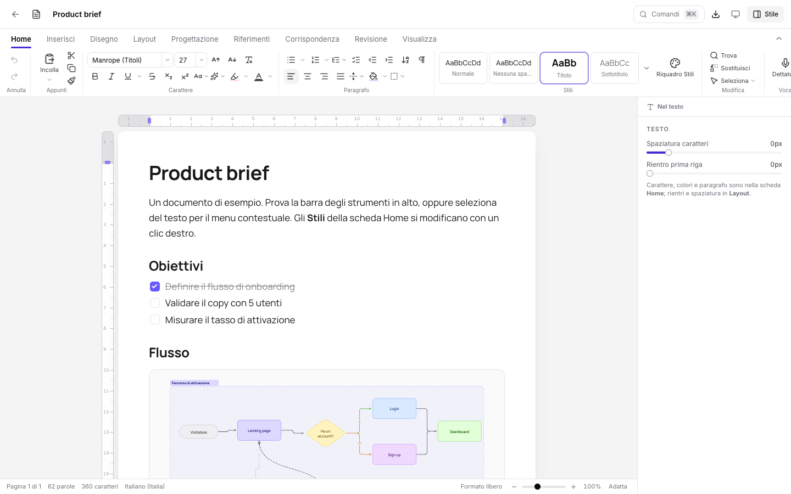
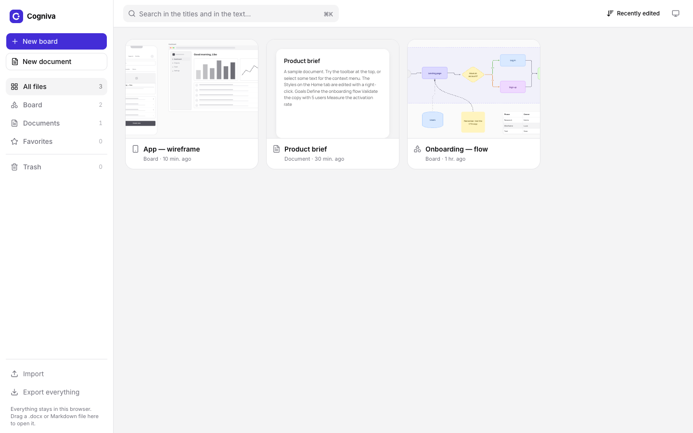
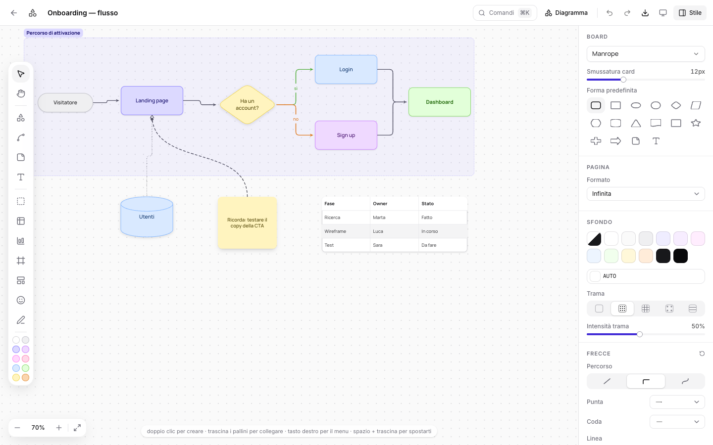
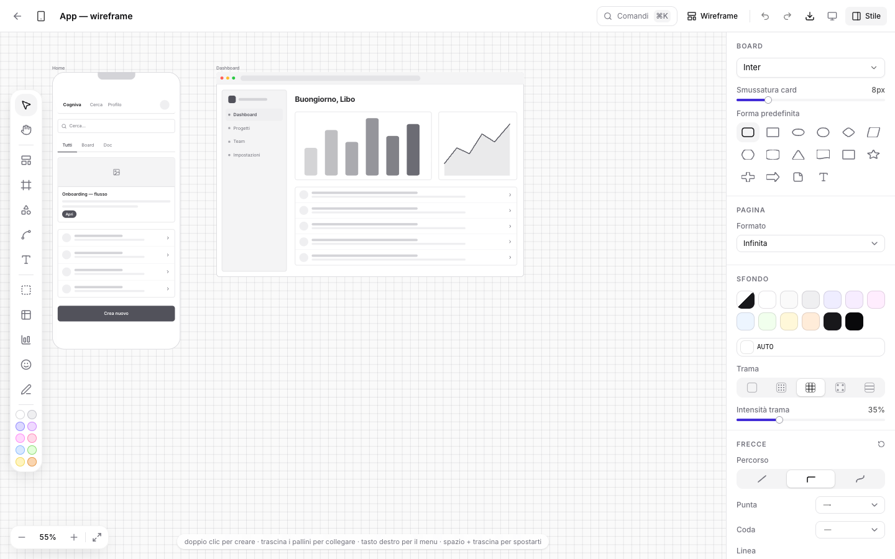
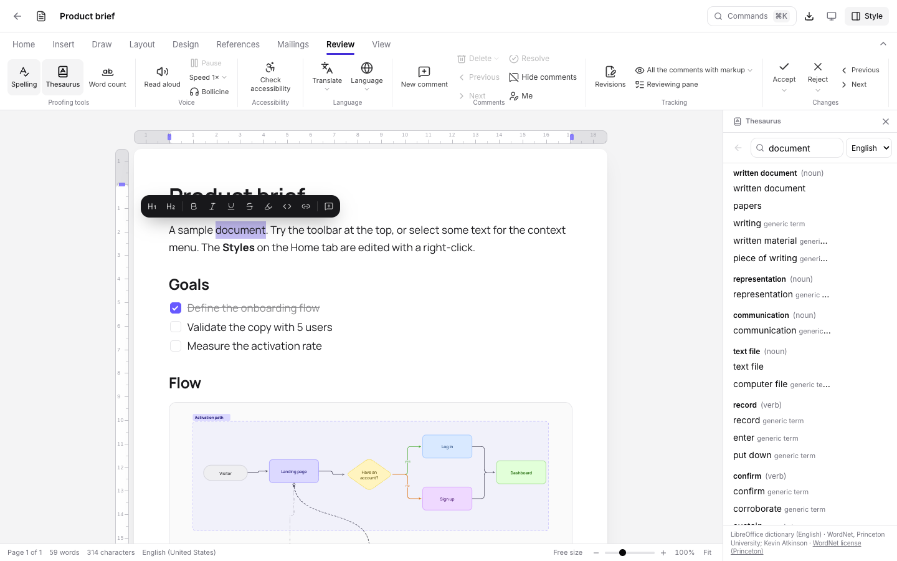
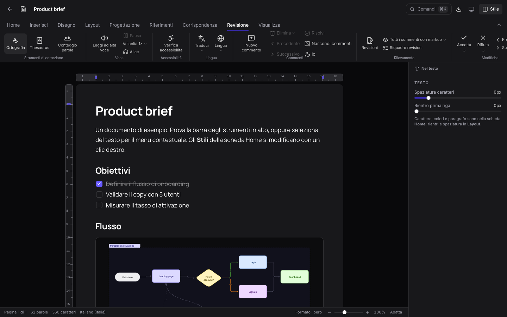

<div align="center">


# Cogniva

### 🧠 Boards and documents in one app. Everything stays in your browser. ✨

Diagrams, wireframes and professional documents: **no account**, **no server**, even **offline**.

[](https://github.com/libi1998/Cogniva/releases/latest)
[](https://github.com/libi1998/Cogniva/actions/workflows/ci.yml)
[](https://nextjs.org)
[](https://react.dev)
[](https://www.typescriptlang.org)
[](https://tailwindcss.com)
[](https://playwright.dev)
[](LICENSE)
[](#-license)

[][paypal]

[🚀 Quick start](#-quick-start) · [✨ Features](#-what-you-can-do) · [📸 Screenshots](#-screenshots) · [🔒 Privacy](#-privacy-and-security) · [📖 Full guide](docs/GUIDE.md) · [☕ Support me](#-enjoying-cogniva)

<br />



</div>

---

## 💡 Why Cogniva

- 🔒 **Truly private** — your files never leave your browser. No account, no cloud, no tracking.
- 📴 **Works offline** — translation, neural voices and synonyms run on your device, even without internet.
- 📝 **A complete word processor** — nine ribbon tabs plus a contextual one for tables, pictures, shapes and charts: styles, track changes, footnotes, citations, mail merge, table of contents and much more.
- 🗂️ **Your files in order** — folders, favorites and multi-select to move, duplicate, export or delete many files at once.
- 🗺️ **Infinite boards** — flowcharts, wireframes and brainstorming, ready to paste into your documents.
- 🔁 **Plays well with others** — open DOCX and Markdown files, export to DOCX, **real vector PDF**, Markdown, PNG, SVG and JSON.
- ⚡ **Blazing fast** — Next.js 16 with prerendering and the React Compiler: a keystroke takes under a millisecond, even in a 12,000-word document, and boards redraw once per frame however fast you drag.
- 🌗 **Light, dark, everywhere** — light and dark themes on desktop, tablet and phone.
- 🌍 **Speaks your language** — the whole interface in 🇮🇹 Italian, 🇬🇧 English, 🇪🇸 Spanish, 🇫🇷 French, 🇩🇪 German and 🇧🇷 Portuguese. It picks the one your browser asks for, and you can switch any time.

---

## 📸 Screenshots

<table>
  <tr>
    <td width="50%"><br /><div align="center">🏠 <b>All your files</b></div></td>
    <td width="50%"><br /><div align="center">🗺️ <b>Diagrams</b></div></td>
  </tr>
  <tr>
    <td width="50%"><br /><div align="center">📱 <b>Wireframes</b></div></td>
    <td width="50%"><br /><div align="center">📚 <b>Thesaurus and review</b></div></td>
  </tr>
  <tr>
    <td colspan="2"><br /><div align="center">🌙 <b>Dark mode</b></div></td>
  </tr>
</table>

---

## ✨ What you can do

### 🏠 All your files

- 🗂️ **Folders** in the sidebar: drag files onto them, or use _Move to_; rename or delete a
  folder and its files stay safe
- ☑️ **Select several files** with the checkbox, ⌘/Ctrl + click, ⇧ + click or ⌘A, then
  favorite, duplicate, move, export or trash them in one go — with Undo
- 🔎 **Full-text search** inside every file, ⭐ favorites and a 🗑️ trash that keeps files for 30 days

### 🗺️ Boards

- 🧭 **Three modes**: _Diagram_ for flows, _Wireframe_ for interfaces, _Cards_ for brainstorming and kanban
- 🔷 **16 shapes**, 📐 **35 wireframe components** and 📱 **frames** for browser, desktop, tablet, phone and watch
- 🔗 **Connectors** that are straight, elbowed or curved, even with a hand-drawn look
- 📊 **Tables and charts** (column, line, pie, radar…) with data pasted from any spreadsheet
- ✏️ **Freehand drawing**, 🎯 alignment guides and 📄 A4 pages or an infinite canvas

### 📝 Documents

<details open>
<summary><b>✍️ Write and format</b></summary>

- 🎨 **Editable styles** with a style gallery, plus **Paragraph** and **Font** dialogs like
  Word's (keep with next, page break before, small caps, character spacing…)
- 🔤 **308 modern fonts**, including free metric-compatible alternatives to the most common document fonts
- 📃 **Real pages** — a new document starts on a full A4 sheet — with margins, columns and
  line numbers
- 🧾 **Headers and footers written right on the sheet** as free text: double-click the
  margin, add a logo, a line, page numbers, title, author or date; `Tab` moves to the
  center and to the right, like Word
- 🎛️ **A contextual tab** for the object you're working on — _Table_, _Picture format_,
  _Shape format_, _Chart format_, _Table of contents_… — that opens by itself on insert
- ¶ **Formatting marks** for spaces, tabs, line breaks, paragraphs and cells
- 🎨 **Colored bullets and numbers** for every list
- 🎙️ **Dictation**: just speak and the text appears, punctuation included
- 🔍 **Find and replace**, word count and spell check
- ✨ **AutoCorrect** while you type: smart quotes, dashes, `(c)` → ©, `1/2` → ½, capital
  letters at the start of a sentence and your own replacement table
- 🕘 **Version history**: the document saves itself every few minutes, and you can restore
  or compare any earlier version — all inside your browser
- 🔖 **Pick up where you left off**: reopening a document offers to take you back to the
  page you had reached

</details>

<details>
<summary><b>🧱 Insert</b></summary>

- 🔲 **Tables like Word's**: borders side by side with pen style, width and color, shading,
  nine-position alignment, cell margins and row height for every cell; drag the handles
  to resize the whole table, or type its width and height
- ✥ **A move handle** on tables, charts, tables of contents, boards and more: click to
  select, drag to move between paragraphs
- 🖼️ Pictures with seven text wrapping options, icons and smart diagrams
- 🔷 **Shapes** with a solid fill and outline, text inside, free to move on the page
- 📊 Charts, 🧮 LaTeX equations, 🎬 online videos (YouTube, Vimeo, Loom…)
- 🧊 **3D models** you can rotate with the mouse, or 12 ready-made 3D shapes
- 🗺️ Embedded boards, cover pages, bookmarks and cross-references

</details>

<details>
<summary><b>📚 References and mailings</b></summary>

- 📑 **Table of contents** with an editable title, dot leaders and page numbers, and a table of figures, both updating themselves
- 🎓 **Citations and bibliography** in APA, MLA, Chicago and ISO 690
- 🦶 Footnotes and endnotes, 🏷️ captions
- ✉️ **Mail merge**: envelopes, labels, fields and rules

</details>

<details>
<summary><b>🔍 Review</b></summary>

- 🖍️ **Track changes** with accept and reject, 💬 threaded comments, 🆚 document comparison
- 🕘 **Version history** with restore and compare, ✨ **AutoCorrect** options and table
- 📚 **Thesaurus** (`⇧F7`) in 6 languages
- 🔊 **Read aloud** with word-by-word highlighting and neural voices
- 🌍 **Translate** the selection or the whole document
- ♿ **Accessibility checker** and 🔐 restrict editing

</details>

<details>
<summary><b>👀 View</b></summary>

- 📖 Read mode, 🎯 focus mode and immersive reader
- 🧾 Print layout, web layout, outline and draft
- 🔎 Zoom, one page, multiple pages and full screen

</details>

### 🧩 Add-ins

They open in a pane next to your document, from **Home › Add-ins**:

| Add-in                  | What it does                                      | Internet |
| ----------------------- | ------------------------------------------------- | :------: |
| 🔳 **QR Code**          | Links, Wi-Fi, e-mail and phone numbers as a code  |    ❌    |
| 📈 **Readability**      | Readability score and sentences to simplify       |    ❌    |
| 📄 **Placeholder text** | Sample paragraphs to lay out your pages           |    ❌    |
| ✍️ **Signature**        | Your handwritten signature as a transparent image |    ❌    |
| 📚 **Wikipedia**        | An article summary with its source                |    ✅    |
| 🖼️ **Free images**      | Creative Commons images with author and license   |    ✅    |

### 🤖 On-device AI

Nothing is sent to external services: models are downloaded once and then work offline.

| Feature              | How it works                                                                | First use |
| -------------------- | --------------------------------------------------------------------------- | :-------: |
| 🌍 **Translation**   | The browser's built-in translator where available, otherwise OPUS-MT models |  ~130 MB  |
| 🔊 **Neural voices** | 15 Piper voices in 9 languages, all with open licenses                      |  ~64 MB   |
| 📚 **Thesaurus**     | LibreOffice synonym dictionaries                                            |  2–30 MB  |

### 📥 Import and export

| Import 📥                     | Export 📤                              |
| ----------------------------- | -------------------------------------- |
| `.docx`, Markdown, HTML, text | `.docx`, PDF, Markdown, PNG, SVG, JSON |

Just **drag a file** onto the window to open it. 🪄

Exporting opens a **preview of every page** with its settings — format, pages, paper,
colors, file name — and builds the PDF right in the app, no print dialog. 🖨️ It's a
**real vector PDF**: text drawn from the same font files the browser uses, sharp at any
zoom, with clickable links and **always selectable, searchable text**; what can't be
vector (photos, shadows, filters) is rendered at **600 dpi**. The document's SVG is true
vector paths too.

### 🌍 Languages

The whole interface is available in **Italian 🇮🇹, English 🇬🇧, Spanish 🇪🇸, French 🇫🇷, German
🇩🇪 and Portuguese 🇧🇷**.

- 🔎 **It finds you** — the first visit follows the language your browser and system ask
  for; anything unknown falls back to English.
- 🔁 **Switch any time** — the appearance menu (top right) and the command palette (`⌘K`)
  change language and remember the choice.
- 🔗 **Shareable** — the language lives in the address (`/en/…`, `/de/…`), so a link always
  opens in the language it was shared in.
- 📦 **Nothing wasted** — each page downloads only the phrases it needs.

Adding a phrase? Wrap it in `t("…")` and run `pnpm i18n` to update the catalogs in
`lib/i18n/catalog/`. 🧵

---

## 🚀 Quick start

**You'll need:** [Node.js](https://nodejs.org) 20.9 or newer (24 recommended) and [pnpm](https://pnpm.io) 11.

```bash
git clone https://github.com/libi1998/Cogniva.git
```

```bash
cd Cogniva
```

```bash
pnpm install
```

```bash
pnpm dev
```

Then open 👉 **http://localhost:3000** — a sample board, wireframe and document are waiting for you. 🎉

### 🧰 Useful commands

| Command         | What it does                                           |
| --------------- | ------------------------------------------------------ |
| `pnpm dev`      | 🔥 Starts the app in development mode                  |
| `pnpm build`    | 📦 Creates the production build                        |
| `pnpm start`    | ▶️ Runs the production build                           |
| `pnpm check`    | ✅ Checks types, lint and formatting                   |
| `pnpm test:e2e` | 🧪 Runs the tests in real browsers (Chrome and Safari) |
| `pnpm format`   | 💅 Formats the code                                    |
| `pnpm i18n`     | 🌍 Updates the translation catalogs                    |

---

## ⌨️ Favorite shortcuts

| Keys            | Action                                   |
| --------------- | ---------------------------------------- |
| `⌘K` / `Ctrl+K` | 🎛️ Command palette                       |
| `?`             | 📋 All shortcuts                         |
| `⌘F`            | 🔍 Find and replace                      |
| `⇧F7`           | 📚 Thesaurus                             |
| `⌥⌘M`           | 💬 New comment                           |
| `⌥⌘F`           | 🦶 Footnote                              |
| `⌘Z` / `⇧⌘Z`    | ↩️ Undo and redo                         |
| `V` `R` `C` `T` | 🗺️ Boards: select, card, connector, text |

---

## 🔒 Privacy and security

- 💾 **Your files live in IndexedDB**, inside your browser: no server ever sees them
- 🚫 **No third-party code** runs in the page: every add-in is written in Cogniva
- 🛡️ **Strict Content Security Policy**, with a single external script allowed (the voice phonemizer, locked with SRI)
- 🧼 **Files you open are treated as untrusted**: an imported `.docx`, `.html` or `.json` cannot add style rules of its own, call out to a remote address or keep a `javascript:` link
- 🔐 **Models, voices and dictionaries** come from pinned addresses and are verified with SHA-256
- 🌐 Wikipedia and Free images **tell you when they use the internet** and start disabled

---

## 🛠️ Tech stack

| Area             | Tools                                                                            |
| ---------------- | -------------------------------------------------------------------------------- |
| ⚛️ **Framework** | Next.js 16 (App Router, Turbopack, Cache Components) · React 19 · React Compiler |
| 🎨 **UI**        | Tailwind CSS 4 · shadcn/ui on Base UI · Lucide                                   |
| 📝 **Editor**    | Tiptap 3 with a custom pagination engine · KaTeX                                 |
| 🗃️ **Data**      | Zustand · IndexedDB                                                              |
| 🧊 **3D**        | three.js                                                                         |
| 🤖 **Local AI**  | Transformers.js · ONNX Runtime Web · Piper                                       |
| 📄 **Files**     | docx · mammoth · marked · html2canvas-pro                                        |
| 🧪 **Quality**   | TypeScript strict · ESLint · Prettier · Playwright                               |

<details>
<summary><b>🗂️ Project structure</b></summary>

```text
app/                  🧭 routes: home, board, document
components/
├── board/            🗺️ canvas, tools, elements, connectors
├── doc/              📝 editor, ribbon, panels, add-ins
├── home/             🏠 file overview
├── shared/           🧩 command palette, charts, shared panels
└── ui/               🎛️ base components (shadcn/ui)
lib/
├── read-aloud/       🔊 read aloud and neural voices
├── translate/        🌍 on-device translation
├── thesaurus/        📚 synonym dictionaries
├── model3d/          🧊 3D model viewer
└── …                 💾 store, persistence, import/export, pagination
e2e/                  🧪 Playwright tests
docs/                 📖 full guide and screenshots
```

</details>

📖 Every detail, feature by feature, is in the **[full guide](docs/GUIDE.md)**.

---

## 📦 Third-party components

Downloaded by the browser only when needed, never bundled with the project:

| What                                | License                                          |
| ----------------------------------- | ------------------------------------------------ |
| 🌍 OPUS-MT translation models       | CC BY 4.0                                        |
| 🔊 Piper voices                     | CC0, public domain, CC BY (shown for each voice) |
| 🗣️ espeak-ng phonemizer             | GPL-3.0                                          |
| 📚 LibreOffice synonym dictionaries | GPL-3.0, LGPL-2.1, WordNet, CC BY 3.0            |

---

## 🤝 Contributing

Ideas, bug reports and improvements are all welcome! 💜

1. 🍴 Fork the project
2. 🌱 Create a branch: `git checkout -b my-idea`
3. ✅ Make sure everything passes: `pnpm check` and `pnpm test:e2e`
4. 📬 Open a pull request describing what you changed

Every pull request runs the same three commands on GitHub Actions
([`ci.yml`](.github/workflows/ci.yml)): `pnpm check`, `pnpm build` and
`pnpm test:e2e` in Chromium and WebKit.

Found a bug? 🐛 Open an **issue** with the steps to reproduce it.

---

## ☕ Enjoying Cogniva?

Cogniva took countless hours of work — and just as many coffees. 😄
If it's useful to you and you'd like to support its development, **buy me a coffee**: every contribution helps bring new features to life! 🙏

<div align="center">

[][paypal]

⭐ A **star** on GitHub means a lot too!

</div>

---

## 📄 License

Cogniva is released under the **MIT License** 🎉: you're free to use, modify and redistribute it, commercial projects included, as long as you keep the copyright notice. The full text is in the [LICENSE](LICENSE) file.

The fonts in the `fonts/` folder come from Google Fonts and keep their own licenses (SIL Open Font License, Apache 2.0 or Ubuntu Font Licence). Models, voices and dictionaries downloaded on demand have the licenses listed under [Third-party components](#-third-party-components).

<div align="center">

Made with ❤️ and ☕ in Italy 🇮🇹 by **Liborio Riggi**

</div>

[paypal]: https://www.paypal.me/liborioriggi98
